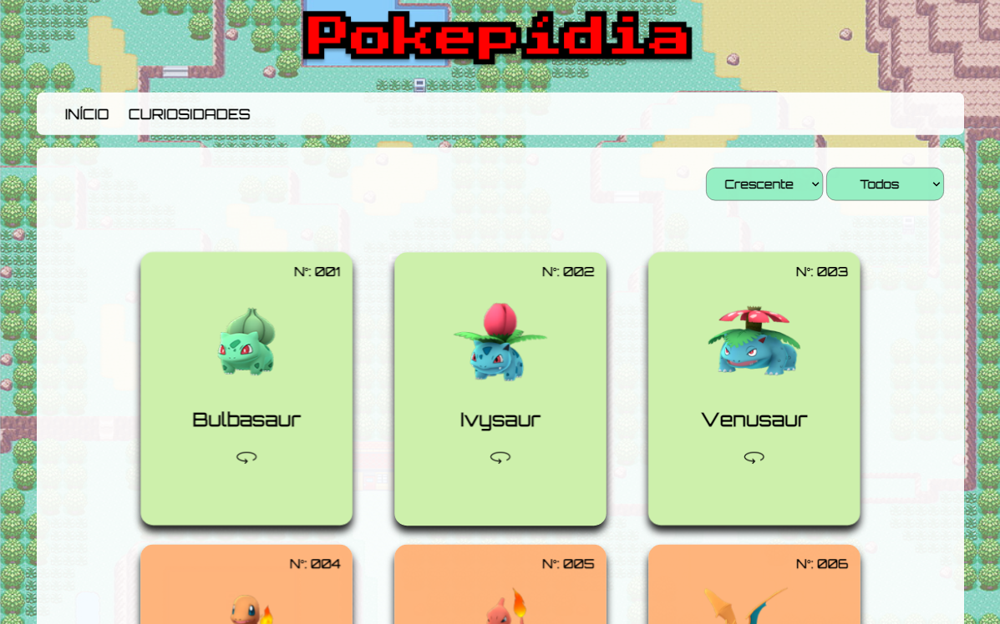
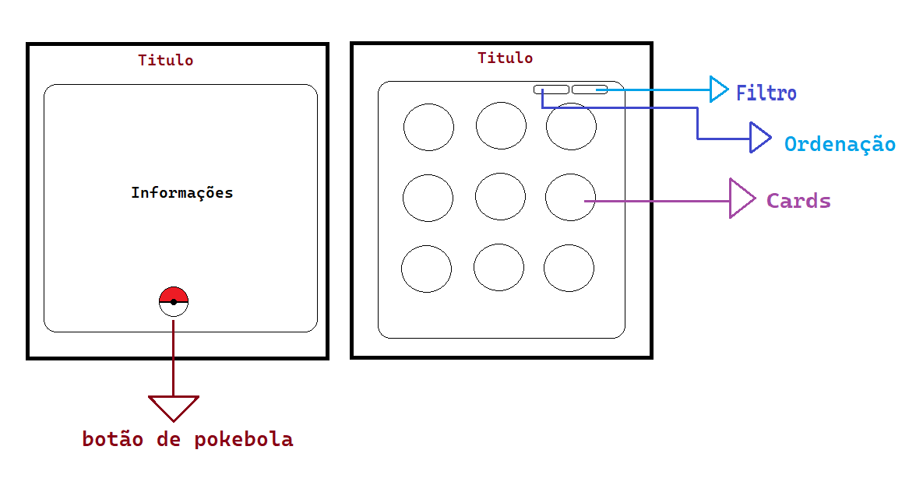
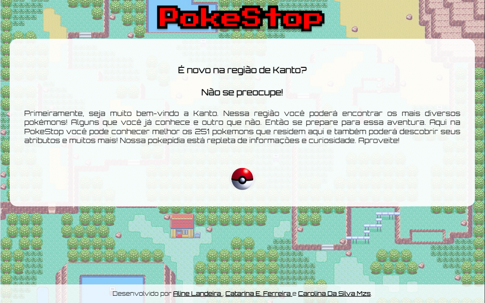
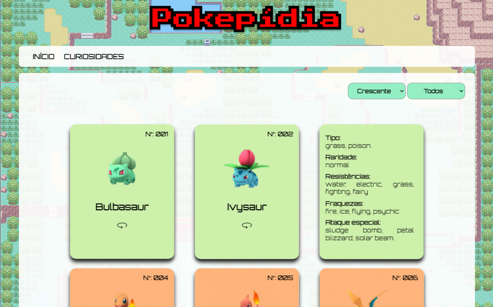
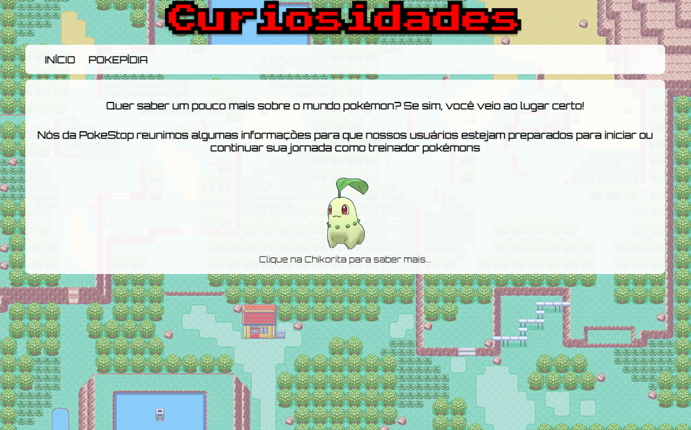
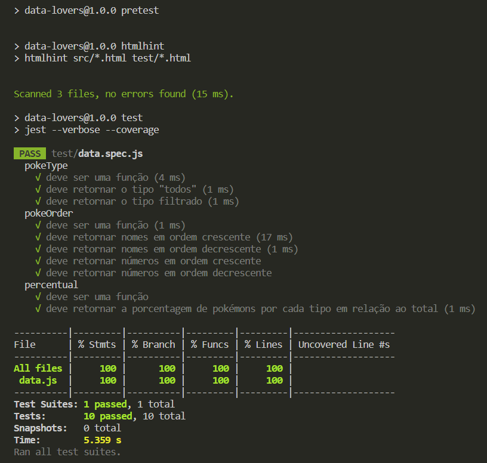

# [Data Lovers — PokeStop](https://catarinaeudoxia.github.io/SAP010-data-lovers/)

## Índice

* ### [ 1. Prelúdio](#1-prelúdio)
* ### [2. Visão geral do projeto](#2-visão-geral-do-projeto)
* ### [3. Objetivos ](#3-objetivos)
* ### [4. Protótipos](#4-protótipos)
* ### [5. Critérios de aceitação e hacker edition alcançados](#5-critérios-de-aceitação-e-hacker-edition-alcançados)
* ### [6. Ferramentas e mecanismos usados](#6-ferramentas-e-mecanismos-usados)
* ### [7. Checklist](#7-checklist)
* ### [8. Acesse a PokeStop aqui](#8-acesse-a-pokestop-aqui)
* ### [9. Projeto desenvolvido por](#9-projeto-desenvolvido-por)

 

 

# 1. Prelúdio

### O projeto Data Lovers foi elaborado com o propósito de aprimorar nossas habilidades e aplicar os conhecimentos adquiridos durante o bootcamp da Laboratória. Nosso principal objetivo foi explorar e utilizar diversas técnicas, como filtragem, ordenação, cálculo agregado, desenvolvimento de testes e trabalho colaborativo no GitHub. Tudo isso foi realizado a partir de um arquivo de dados fornecido pela Laboratória, proporcionando uma experiência prática e enriquecedora. 
 

# 2. Visão geral do projeto

### Em nosso emocionante projeto, fomos apresentados a uma variedade de temas interessantes, cada um deles contendo uma base de dados rica em informações valiosas, como nomes, números, tipos e muito mais. Essa base de dados foi estruturada em um array contendo diversos objetos específicos.

### Com determinação e dedicação, aprendemos a trabalhar com o acesso aos objetos, utilizando funções, parâmetros, map, filter, sort e cálculo agregado. Além disso, mergulhamos no mundo do Git colaborativo, onde pudemos trabalhar em equipe e aprender com cada passo dado.

### No meio de tantos temas interessantes, escolhemos explorar o universo Pokémon, que nos presenteou com uma base de dados contendo 251 criaturas da região de Kanto. Nosso foco era trazer essas informações para os jogadores e aspirantes a treinadores, permitindo que eles mergulhassem no mundo dos Pokémons.

### Nosso objetivo era desenvolver uma interface intuitiva e cativante, onde as pessoas pudessem desfrutar das informações detalhadas sobre cada Pokémon. Através dela, seria possível explorar características como números, nomes, tipos, resistências, fraquezas e ataques especiais. Além disso, implementamos a capacidade de aplicar filtros por tipo e realizar ordenações numéricas ou alfabéticas, para oferecer uma experiência personalizada.

### Embora sejamos iniciantes na programação, estamos animados para compartilhar os resultados de nossos esforços. Buscamos criar uma experiência envolvente, despertando a curiosidade e a paixão pelos Pokémons. Queremos que todos possam se divertir ao explorar as características de cada criatura, conectar pessoas apaixonadas por esse mundo e oferecer uma interface interativa que proporciona uma imersão única. 

### Estamos empolgadas para tê-lo(a) ao nosso lado nessa incrível jornada como programadoras em desenvolvimento!  
 

# 3. Objetivos
 ### O projeto possui um objetivo principal e objetivos opcionais que podem ser escolhidos para guiar nossa estratégia de trabalho. Confira abaixo:
 

## Objetivo Principal:

* ### Desenhar e construir uma interface web que permita visualizar e manipular dados, levando em consideração as necessidades do usuário. 
 

## Objetivos Opcionais:

* ###  Desenvolver uma interface web que permita visualizar e manipular os dados da base de dados.
* ###  Utilizar habilidades em HTML, CSS e JavaScript para criar uma interface atraente e funcional.
* ###  Aplicar técnicas como map, filter, sort e cálculo agregado para acessar e manipular os objetos da base de dados.
* ###  Trabalhar com funções, parâmetros de funções e manipulação dinâmica do DOM.
* ###  Utilizar Git colaborativo para o controle de versões e trabalho em equipe.
* ###  Construir testes unitários para garantir a qualidade do código.
 

# 4. Protótipos

## — Protótipo de baixa fidelidade:

## —  Protótipo de alta fidelidade:

## — Testes unitários:

 

# 5. Critérios de aceitação e hacker edition alcançados
### Critérios mínimos de aceitação do projeto:

* [✔] Definição de produto.

* [✔] Histórias de usuário.

* [✔] Protótipo de baixa fidelidade.

* [✔] Protótipo de alta fidelidade.

* [✔] Testes de usabilidade.

* [✔] Implementação da interface de usuário (HTML/CSS/JS).

* [✔] Testes unitários.

* [✔] 100% de cobertura nos testes.

* [✔] A interface será "implantada" usando o GitHub Pages.

* [✔] O README contém uma definição de produto.

 

# 6. Ferramentas e mecanismos usados:

###  — HTML

### — CSS 

### — JavaScript 

### — VSCODE 

### — Figma 

### —  Canva

### — Git bash 

### — Node.js

### — Jest

### — Notion

 

# 7. Checklist

* ### [✔] Usar VanillaJS.
* ### [✔]Passa pelo linter (`npm run pretest`)
* ### [✔] Passa pelos testes (`npm test`)
* ### [✔] Testes unitários cobrem um mínimo de 70% de statements, functions, lines e branches.
* ### [✔] Inclui uma _definição de produto_ clara e informativa no `README.md`.
* ### [✔] Inclui histórias de usuário no `README.md`.
* ### [✔] Inclui rascunho da solução (protótipo de baixa fidelidade) no `README.md`.
* ### [✔] Inclui uma lista de problemas detectados nos testes de usabilidade no `README.md`.
* ### [✔] UI: Mostra lista/tabela/etc com dados e/ou indicadores.
* ### [✔] UI: Permite ordenar dados por um ou mais campos (asc e desc).
* ### [✔] UI: Permite filtrar dados com base em uma condição.
* ### [✔] UI: É _responsivo_.
 

# 8. Acesse a PokeStop aqui:

### Acesse o [PokeStop](https://catarinaeudoxia.github.io/SAP010-data-lovers/) aqui! 

 

# 9. Projeto desenvolvido por:
 

  <table>
    <tr>
      <td align="center">
        <a href="#">
           
          
            <b>Aline Landeira</b>
          
        </a>
      </td>
      <td align="center">
        <a href="#">
            
          
            <b>Catarina Eudoxia Ferreira</b>
          
        </a>
      </td>
      <td align="center">
        <a href="#">
           
          
            <b>Carolina Menezes</b>
          
        </a>
      </td>
    </tr>
  </table>